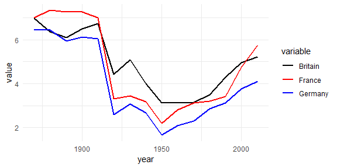
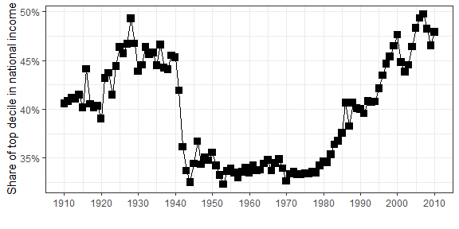
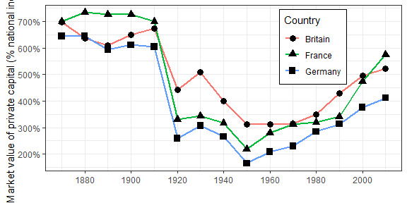

Capital 21
================
Berent Lunde

#### Datasets from the book: "Capital in the Twenty-First Century" by Thomas Piketty.

The Capital21 package provides an easy interface for the datasets used in the book "Capital in the Twenty-First Century" by Thomas Piketty.

Authored and maintained by [Berent Å. S. Lunde](https://berentlunde.netlify.com).

Installation instructions:

``` r
library(devtools)
install_github("Blunde1/Capital21")

# Optionally run example
runExample()
```

Examples:
---------

#### Loading chapter data into global environment

``` r
library(Capital21)

# Load and list chapter 0 data
chapter_0_data()
```

> "The capital/income ratio in Europe, 1870-2010"

| year       |   Germany|    France|   Britain|
|:-----------|---------:|---------:|---------:|
| 1870-01-01 |  6.438988|  6.992606|  6.961611|
| 1880-01-01 |  6.443348|  7.328977|  6.367099|
| 1890-01-01 |  5.923051|  7.264028|  6.092323|
| 1900-01-01 |  6.112386|  7.261795|  6.499294|

#### Reproducing figures

``` r
# Packages for data wrangeling
library(ggplot2)
library(dplyr)
library(tidyr)

# Load data from Capital21
data("capital_V_income_eu")

# Melt and plot data 
p <- capital_V_income_eu %>%
    gather(key = "variable", value = "value", -year) %>%
    ggplot + 
    aes(x = year, y = value) + 
    geom_line(aes(color = variable), size=1) +
    scale_color_manual(values = c("black","red","blue")) +
    theme_minimal()
p
```



#### Retrieve all figures from a chapter

``` r
# Typically relies on ggplot2 and dplyr
get_figures(chapter = 0)
FI.1
```



``` r
FI.2
```


